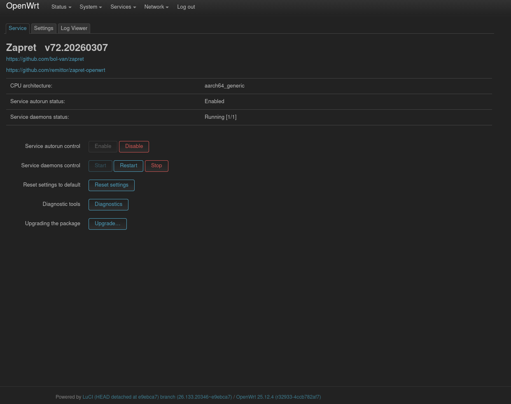

# zapret-openwrt

*Zapret is not a VPN! Zapret is an advanced Anti-DPI (Deep Packet Inspection) utility designed to bypass network restrictions directly from your router.*

---

*  **[Installation Guide](https://github.com/remittor/zapret-openwrt/wiki)** — Step-by-step instructions on how to set up the package on your router.
*  **[Download Releases](https://github.com/remittor/zapret-openwrt/releases)** — Grab the latest pre-compiled packages (`.ipk`) for your OpenWrt architecture.
*  **[Support the Developer](https://github.com/remittor/donate)** — Consider donating to support the continued maintenance of this project.

---

### Screenshots

  

---

### Key Features
* **Lightweight Efficiency:** Runs directly on your router, protecting all connected devices (TVs, smartphones, PCs) without requiring client-side software.
* **Deep Packet Inspection Bypass:** Uses sophisticated techniques (like packet splitting, TLS SNI modification, and fragmentation) rather than tunneling, maintaining your full ISP connection speed.
* **LuCI Integration:** Fully integrated into the OpenWrt web panel for easy configuration.
